# TaskFlow Pro Architecture

## 1. High level overview
- **Client**: React + Vite SPA with TailwindCSS, WebSocket chat, RBAC-aware navigation.
- **API Gateway**: FastAPI service exposing Auth, User, Task, Chat, File, Report, Export endpoints with JWT security.
- **Services**:
  - Auth / Users / Tasks share a single FastAPI app with SQLAlchemy models.
  - Redis queue handles async notification fan-out to Telegram bot.
  - MinIO (S3 compatible) stores attachments, signed URLs returned to the UI.
  - Telegram bot (Aiogram 3) issues credentials, routes approvals, and delivers notifications.
  - Google Sheets exporter uses service account credentials to produce spreadsheets.
- **Infra**: Docker Compose orchestrates Postgres, Redis, MinIO, backend, frontend, Telegram bot, and Nginx.

## 2. ERD (Mermaid)

## 3. UML Sequence (task lifecycle)

```mermaid
sequenceDiagram
    participant Manager
    participant API
    participant Employee
    participant Telegram
    participant Director

    Manager->>API: POST /tasks
    API->>Telegram: Notify assignee
    Employee->>API: POST /tasks/{id}/status (IN_PROGRESS)
    Employee->>API: Upload files + chat
    Employee->>API: POST status (PENDING_REVIEW)
    API->>Manager: Telegram "📤 Vazifa topshirildi"
    alt Cross department
        API->>Director: Telegram approve inline
        Director->>API: Approve callback
    end
    Manager->>API: POST status (COMPLETED)
    API->>Employee: Telegram "✅ Qabul qilindi"
```

## 4. Deployment Notes
- Expose Nginx on port 80, route `/api` to FastAPI and `/` to Vite build.
- Mount `.env` with secrets (JWT keys, bot token, Google credentials path).
- Use Alembic migrations before starting the API container.
- Cron-like jobs (daily summary) run via background task in Telegram bot or Celery worker hooking Redis queue.
